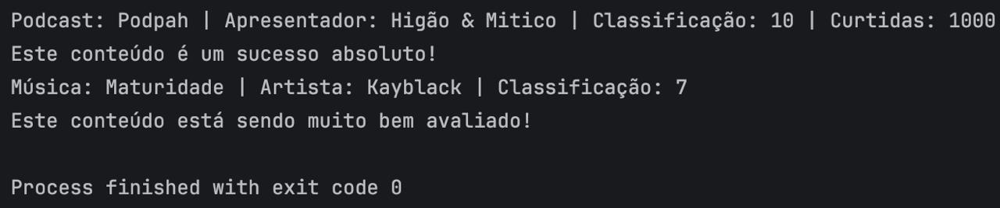

# 🎵 AudioMatch - Streaming Simulation (Java & OOP)

> 💡 A clean and extensible simulation of a streaming platform, designed to demonstrate strong Object-Oriented Programming principles in Java.

---

## 🇧🇷 Português

Este projeto foi desenvolvido durante minha especialização em **Desenvolvimento Back-End com Java**.

A proposta é simular o comportamento de uma plataforma de streaming, aplicando na prática os principais pilares da Orientação a Objetos com foco em **boas práticas de mercado, organização e escalabilidade**.

## 🚀 Destaques Técnicos

Este projeto foi estruturado com foco em legibilidade, reuso e fácil manutenção:

* **Abstração e Herança**: A superclasse `Audio` centraliza comportamentos comuns entre diferentes tipos de mídia.
* **Interfaces (Contratos)**: A interface `Classifiable` desacopla a lógica de classificação dos objetos.
* **Polimorfismo**: A classe `Favorites` trabalha com qualquer objeto que implemente `Classifiable`, permitindo expansão do sistema sem alteração da regra principal.
* **Encapsulamento**: Atributos protegidos com acesso controlado via getters/setters, garantindo integridade dos dados.
* **Clean Code & Boas Práticas**:

    * Estrutura padrão com Maven (`src/main/java`)
    * Código limpo e organizado
    * Aplicação do princípio DRY (Don't Repeat Yourself)

## 🛠️ Tecnologias

* Java 17
* IntelliJ IDEA
* Maven

## 🏗️ Estrutura do Projeto

* `Audio` → Superclasse base
* `Song` e `Podcast` → Especializações com regras próprias
* `Classifiable` → Contrato de classificação
* `Favorites` → Serviço responsável por filtragem e destaque

## 📖 Como executar

1. Clone o repositório
2. Configure o JDK 17+
3. Execute a classe `Main`

## 🖥️ Exemplo de saída

---

## 🇺🇸 English

This project was developed during my **Java Back-End Development** specialization.

It simulates a streaming platform with a strong focus on **Object-Oriented Programming best practices, code organization, and scalability**.

## 🚀 Key Highlights

This project was designed with readability, reusability, and maintainability in mind:

* **Abstraction & Inheritance**: The `Audio` superclass centralizes shared behaviors across media types.
* **Interfaces (Contracts)**: The `Classifiable` interface decouples classification logic from implementation.
* **Polymorphism**: The `Favorites` class processes any `Classifiable` object, allowing the system to easily support new media types without modifying existing logic.
* **Encapsulation**: Protected attributes with controlled access via getters/setters ensure data integrity.
* **Clean Code & Best Practices**:

    * Standard Maven structure (`src/main/java`)
    * Clean and readable code
    * DRY principle applied

## 🛠️ Tech Stack

* Java 17
* IntelliJ IDEA
* Maven

## 🏗️ Project Structure

* `Audio` → Base superclass
* `Song` & `Podcast` → Specialized classes with custom rules
* `Classifiable` → Classification contract
* `Favorites` → Filtering and highlighting service

## 📖 How to run

1. Clone the repository
2. Set up JDK 17+
3. Run the `Main` class

## 🖥️ Sample Output

---

## 📌 Final Note

This project reflects my evolution in Java and Object-Oriented Programming, focusing not only on making things work — but on building **scalable, maintainable, and well-structured solutions**.
